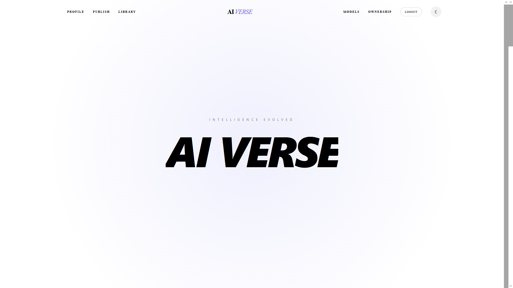

# 🚀 AI Model Dashboard

### 🧠 Short Description
**AI Model Dashboard** is a full-stack web application that allows users to **view, manage, and store AI model–related data** efficiently. Built with **React, Framer Motion, GSAP, and Lenis** on the frontend, and **Node.js + Express + MongoDB + Firebase Admin** on the backend, it provides a smooth, responsive, and interactive SaaS-style interface.

---

## 🌐 Live Demo

- **Frontend (Client):** [visionary-fenglisu-d5a583.netlify.app](https://visionary-fenglisu-d5a583.netlify.app)  
- **Backend (Server):** [https://server-3-3f0uy85j7-nabils-projects-9b9745ef.vercel.app](https://server-3-3f0uy85j7-nabils-projects-9b9745ef.vercel.app)

---

## 🖥️ Desgin Screenshot


---

## 🎯 Key Features
- View AI models and their metadata in a structured dashboard
- Add, edit, and delete AI model entries
- Smooth animations and scroll effects using **Framer Motion**, **GSAP**, and **Lenis**
- Responsive UI built with **Tailwind CSS**
- Secure backend with **Node.js**, **Express**, **MongoDB**, and **Firebase Admin SDK**
- CORS enabled for safe frontend-backend communication

---

## 🛠️ Tech Stack

### Frontend
- ⚛️ React.js (Vite)
- 🎞 Framer Motion — smooth UI animations
- 💫 GSAP — advanced scroll & reveal effects
- 🌀 Lenis — smooth scrolling
- 🎨 Tailwind CSS — responsive design

### Backend
- 🚀 Node.js + Express.js
- 🗃 MongoDB (Atlas)
- 🔥 Firebase Admin SDK
- 🔐 dotenv for environment variables
- 🌍 CORS enabled

---

## 🔧 Installation / Run Locally

Follow these steps to run **AI Model Dashboard** on your local machine:

### Step 1: Clone the repository
```bash
git clone https://github.com/itsSopno/ai-model.git
cd ai-model
npm install i
npm install react-router
npm install -D tailwindcss postcss autoprefixer
npx tailwindcss init -p
npm install daisyui
npm install framer-motion
npm install gsap
npm install firebase
npm i lenis

FIREBASE_PROJECT_ID=your_project_id
FIREBASE_CLIENT_EMAIL=your_client_email
FIREBASE_PRIVATE_KEY="your_private_key"
MONGO_URI=your_mongodb_connection_string
PORT=5000
npm start
